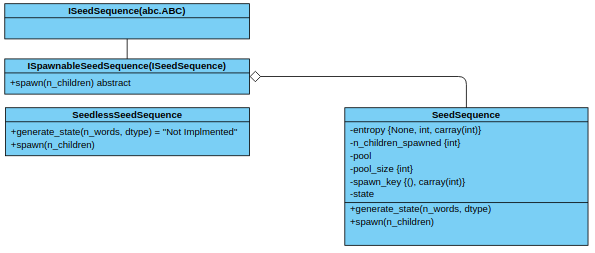
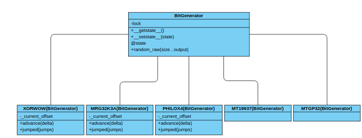
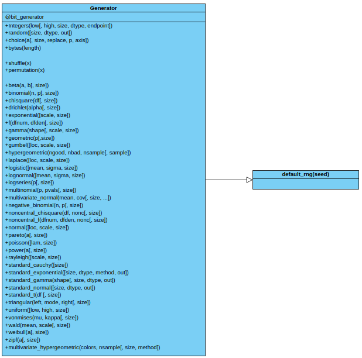

#  Support for New Random Generator interface in CuPy
Niteya Shah, NumFocus 2020

## Abstract
The current implementation of the random module of CuPy is based on RandomState API, which follows the implementation of NumPy < 1.17. This implementation like NumPy relies on a global state seed and all random calls must use this seed. 

The new Generator API of NumPy introduced in 1.17, changes all of that. The new API allows the user to create independent PRNGs, with exclusive states. This makes it much simpler to run in parallel. In addition to this, this methodology is much more in tune with the cuRAND host API, used by CuPy in its current implementation of the random module. This Proposal outlines the work needed to add the Generator API to CuPy.


## Technical Details

### Proposed Solution
GPU-accelerated computing is becoming increasingly popular as growth in the processing power of CPU cannot keep up with rising demands. A large user of GPUs is in scientific computing, where a lot of numerical processing is required. To simulate real-world scenarios, randomized generation of values is necessary. The random module from CuPy provides an excellent base class with low level support for most use cases. 

This work hopes to improve the compatibility of CuPy with NumPy to be better used as a drop-in replacement to instantly achieve a massive speed-up with little to no code changes.

The cuRAND library provides generators which are called to produce random numbers from different distributions which are then transformed to the required distribution. With the new Generator API, the user will have control over most features of the cuRAND generator over a thin abstraction layer.

Additionally the Generator API now supports the argument dtype, which was support by CuPy in its current implementation as well as the out argument which can be used to fill arrays.

The RandomState API is much slower to run in parallel due to constant locking of the state, it affects reproducibility as well due to excessive bookkeeping of changes in state when run in parallel. In comparison, the Generator API can create multiple PRNGs, which will all be able to run concurrently.


### Usage
The Generator API requires a generator object to be created. 

```python
from cupy.random import default_rng
rng = default_rng()
vals = rng.standard_normal(10)
more_vals = rng.standard_normal(10)
```

Unlike in RandomState, where we had to constantly change the state, we can initialize multiple independent Generators, and run them in parallel.

```python
from cupy.random import default_rng
generators = [default_rng() for _ in range(10)]
randoms = [gen.random(10) for gen in generators]
```
Users will also be able to jump Generators, to artificially create generators which have advanced.

```python
import secrets
from cupy.random import XORWOW

seed = secrets.getrandbits(128)
blocked_rng = []
rng = XORWOW(seed)
for i in range(10):
    blocked_rng.append(rng.jumped(i))
```

This work will not affect the RandomState API and that will work as before.
```python
from cupy.random import randn
print(randn(10))
```
\pagebreak

### Design
The Design of the API is just as important as the implementation and while NumPy has thought out most of the issues, some differences will exist from NumPy. 
The Basic UML design of the API is as follows

### SeedSequence classes 


\ 


The ISeedSequence API is a set of abstract classes, with the SeedSequence class as the implementation. SeedSequence is the holder of the state, and is responsible for transforming a number to a high quality seed. 
Just like the NumPy API, the CuPy API for SeedSequence will also be extendable and any object that is a derived member of ISeedSequence.

\pagebreak

### BitGenerator classes
 
 \ 


The BitGenerator set of classes are responsible for generating random byte streams from the instantiated states. These byte streams are then used by the Generator class for producing the random values.
The Base BitGenerator class is meant to be overridden and hence will not be instantiable. The derived classes all represent BitGenerators which are available in cuRAND, which are

* MT19937
* XORWOW
* MRG32K3A
* PHILOX4
* MTGP32

Internally all of these classes will hold cuRAND Generators and will be used to generate the byte streams. BitGenerators 

The BitGenerator can also jump states so that it can be run in parallel or be reused. This functionality is available for some of the Generators and hence only these BitGenerators will be able to exhibit this property. A point to note here is that unlike NumPy, where the offset provided is relative, cuRAND offset values always have to be absolute, leading to a slight change in API where an additional member holding the current offset is required to prevent incorrect jumps.

### Generator class

\ 


The Generator class is the main class and will be responsible for providing all the necessary functions that are available in the random module. Internally it holds the BitGenerator and will use the state to generate the required random values. 
A Generator object will only accept cuRAND acceptable Generator BitGenerators.
The function default_rng is a simple way of creating a Generator with default values with an optional seed(The seed here can be a number to be passed to SeedSequence, a BitGenerator from a which Generator has to be created or a Generator itself which will be returned as is). 
\pagebreak

## Schedule of Deliverables

### Deliverables
The Project can be split into the following parts

1. Implement the SeedSequence classes.
2. Implement bitgen_t struct, the base BitGenerator class and the respective BitGenerators 
    * MT19937
    * XORWOW
    * MRG32K3A
    * PHILOX4
    * MTGP32
3. Implement the Generator API and the default_rng.
4. Update the kernels for changes (Internally only rk_standard_gamma, rk_hypergeometric and rk_gauss have changes, else most have only had their names changed).
5. Add the multivariate_hypergeometric distribution for the Generator API.
6. Add tests to check the Generator API.
7. Make changes to the RandomState API to allow it to use the BitGenerator API internally.
8. Modify tests of RandomState API for conformance and reproducibility.
9. Implement replace for random.choice
10. Implement other BitGenerators which NumPy supports but cuRAND doesn't. (Optional)

### Schedule

#### **Community Bonding Period**
#### May 4th - 31st  May
1. Establish communication channel with my Mentor
2. Setup and configure my environment, build system and tools.
3. Discuss my Project in detail and discuss possible improvements and changes
4. Research the possibility of implementing additional BitGenerators to make the module more NumPy compatible.

#### **Phase 1**
#### 1th June - 5th June
1. Implement the SeedSequence Classes 
1. Add Tests for the SeedSequence Classes and verify reproducibility of entropy generated by seeds.

#### 6th June - 11st June
1. Implement the bitgen struct and the base BitGenerator class.
2. Modify the cuRAND CuPy API to allow for changes to implement other BitGenerators effectively.

#### 12th June to 17th June
1. Add the BitGenerators of the cuRAND library

#### 18th June to 22nd June
1. Add tests for the BitGenerators, enforcing reproducible streams for the same seeds, and check the correctness of jumps and running in parallel.

#### 23rd June to 28th June
1. Get a review of current work done and make the necessary changes.
2. Prepare a report of work done.

#### **Phase 2**
#### 29th June to 10th July
1. Refactor current code to accommodate the Generator API.
2. Implement the Generator API.

#### 11th July to 16th July
1. Implement the default rng function.
2. Update the kernels to the latest version.


#### 17th July to 24th July
1. Add tests for the Generator API.
2. Prepare report for Phase 2.

#### 25th July to 30th July
1. Get a review of current work done and make the necessary changes.
2. Submit Report.

\pagebreak

#### **Final Phase**
#### 31th July to 4th August
1. Add the multivariate_hypergeometric distribution for the Generator API.

#### 5th August to 10th August
1. Modify the RandomState API to use the newer BitGenerator API.

#### 11th August to 13th August
1. Modify the currently existing RandomState tests to accommodate for newer API and check for conformance and reproducibility.

#### 14th August to 19th August
1. Implement replace for choice in the random module.

#### **Final Week**
#### 20th August to 24th August
1. Final review for work done, make the necessary changes and get the PR merged into master.
2. Prepare the final report.


#### Future work
All the points mentioned here are optional and may be done if I'm ahead of schedule, and if time doesn't permit it then will be done after the completion of the program.
1. Add support for other BitGenerators which NumPy supports but cuRAND doesn't.
2. Add jump support for BitGenerator that cuRAND won't support. 

<div style="page-break-after: always;"></div>
\pagebreak

## Development Experience

### Contributions to Open-Source
1. Developed a [tool](https://github.com/niteya-shah/AI-PSO-FPA) that finds the numerical optimization performance of  SPO and FPA algorithms using a many test functions.
2. Created a [Gujarati Audio to text conversion tool](https://github.com/niteya-shah/Gujarati-Automatic-Speech-Recognition) using GRU based Deep Learning in Tensorflow.
3. Developed a [Fluid-Simulation engine](https://github.com/niteya-shah/Fluid-Simulation-CUDA) that could simulate the flow of water liquid particles in a box. The model used SPH and was powered by CUDA using pyCUDA.
4. Developed a [text recognition tool](https://github.com/niteya-shah/Text-Recognition-using-GRU) using GRU in Tensorflow.
5. Contributed to Mlpack,  a Machine Learning library.
6. Contributed to Ensmallen, a numerical optimization library.
7. Currently working on a Tensorflow 2.0 implementation of the [Face Detection tool](https://github.com/niteya-shah/Face-Recognition-Tensorflow2.0) using Triplet Loss.

### Contributions to CuPy
As of writing I have submitted 3 pull requests to CuPy, and have become extremely familiar with the coding style of CuPy and its codebase.

1. Implement gcd and lcm ([#3190](https://github.com/cupy/cupy/pull/3190))
2. Add cupy.select ([#3138](https://github.com/cupy/cupy/pull/3138))
3. Feature - implementation of np.require in CuPy ([#3083](https://github.com/cupy/cupy/pull/3083))


## Other Experiences
I have actively led [TAG](https://www.facebook.com/tagvitu/), a technology and game development club as a member and then as its vice-president during my time in college, where the club massive events which involved over 800 people and was coordinated by me. 

## Why this project?
I have always been interested in high performance computing and its applications, and have extensively used NumPy for my projects. However even with the performance benefits of NumPy over Python, many improvements were still left on the table, namely support from the GPU. CuPy is an excellent library which allows users to achieve fast GPU performance without changing a lot of code. 

I have worked a lot on simulation projects and each of them have used NumPy’s random module to generate the properties of the system. This project will not only improve the compatibility of NumPy and CuPy but also make it simpler to simultaneously generate multiple random systems, as the current implementation is based on a global state which is not suitable for multiple independent simulations. 

All of these important features make this project a great addition to the CuPy codebase, and will be of great use to anyone who uses the random module, both in terms of usability and maintainability. 

## Appendix

### Personal Details
|||
| ----------- | ----------- |
|Name| Niteya Shah|
|University| Vellore Institute of Technology|
|Field of Study| Computer Science |
|Date Study was Started| 27th June 2016|
|Expected Graduation Date| July 2020|
|Phone Number| +91 8511108577|
|Email| niteya.56@gmail.com|
|Github profile| https://github.com/niteya-shah|
|Postal Address| 402 Shyam Sameep, 35 Urmi society, Alkpauri, Vadodara, Gujarat, 390007, India|
|Interests and hobbies| Swimming, listening to music and playing Games.

### Workload and Summer plans
I plan to devote 8 hrs daily (or more if required) to work on this project. I have no exams and will have a Project review that is most probably going to happen via a video call. Hence I will be able to dedicate my full time and effort on this project, and hence will most definitely be able to finish this Project.

##### [Link to this File on Github](https://github.com/niteya-shah/gsoc-proposal)

### References
1. https://numpy.org/neps/nep-0019-rng-policy.html
2. https://numpy.org/doc/1.18/reference/random/index.html
3. https://docs.nvidia.com/cuda/curand/host-api-overview.html
4. https://docs.nvidia.com/cuda/curand/group__HOST.html#group__HOST
5. https://github.com/bashtage/randomgen
6. https://github.com/cupy/cupy
7. https://github.com/numpy/numpy
8. https://docs.python.org/3.8/
